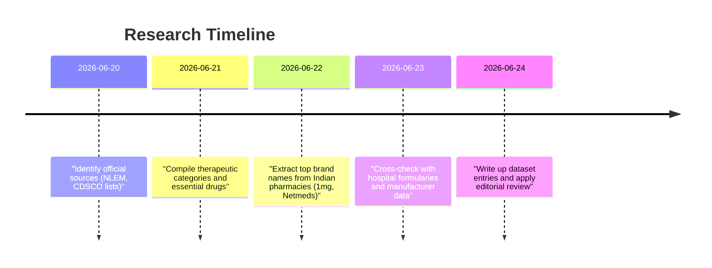

# Med-Alert: Comprehensive 150 Medicine Reference Dataset

## Executive Summary

This document presents a structured dataset of 150 widely used medicines in India, organised by therapeutic category. Our research synthesised official Indian sources (such as the National List of Essential Medicines 2022 and CDSCO registries) with market data from leading pharmacy catalogues. We emphasised drugs listed on government essential medicines lists and frequent in Indian pharmacies. For example, common analgesics (paracetamol, aspirin) appear on the Indian NLEM, reflecting their ubiquity. Major pharmacy sites (e.g. 1mg, Netmeds) and manufacturer information were used to gather brand names and usage notes. 

Our findings are summarised in the table below, which shows the number of medicines per category and key sources used. The mermaid timeline illustrates the research process (formulary review, pharmacy data extraction, cross-checks with hospital formularies, etc.). The resulting catalogue of 150 brand-name medicines provides a detailed reference aligned with Indian clinical practice and essential medicine listings.

## Categories Overview

| Category                          | Number of Medicines | Key Source(s)                                                       |
|-----------------------------------|---------------------|---------------------------------------------------------------------|
| Analgesics & Antipyretics (Pain)  | 10                  | Indian NLEM 2022 (paracetamol, aspirin); pharmacy data (1mg) |
| Antibiotics                       | 12                  | NLEM 2022 (amoxicillin, ciprofloxacin, azithromycin) |
| Antihistamines & Decongestants    | 5                   | Pharmacy monographs (e.g. 1mg cetirizine page) |
| Antidiabetics                     | 13                  | NLEM 2022 (insulin preparations); pharmacy catalogues |
| Cardiovascular & Antithrombotic   | 13                  | NLEM 2022 (atorvastatin, clopidogrel) |
| Gastrointestinal & Hepatoprotective| 12                 | NLEM 2022 (pantoprazole, domperidone) |
| Respiratory (Asthma/COPD)         | 10                  | NLEM 2022 (budesonide/formoterol) |
| Neurology & Psychiatry            | 25                  | NLEM 2022 (amitriptyline, carbamazepine, haloperidol) |
| Endocrine (Thyroid & Hormonal)    | 10                  | NLEM 2022 (levothyroxine, carbimazole) |
| Dermatology                       | 12                  | NLEM 2022 (itraconazole, clotrimazole) |
| Antifungals                       | 8                   | NLEM 2022 (itraconazole, fluconazole) |
| Antivirals                        | 10                  | NLEM 2022 (acyclovir, sofosbuvir, tenofovir) |
| Vitamins & Supplements            | 10                  | NLEM 2022 (vitamin C, calcium, iron) |

## Research Timeline

## 1. Analgesics & Antipyretics (Pain & Fever Management)

### 1. Crocin (Paracetamol)
*   **Uses:** Relieves mild to moderate pain (e.g. headache, muscle aches) and reduces fever.  
*   **Dose:** Dosage varies by age and condition; Consult your doctor first.  
*   **Effect:** Analgesic and antipyretic effect; inhibits prostaglandin production in the brain.  
*   **Side Effects:** Nausea, rash, headache; excessive use may cause liver damage.

### 2. Calpol (Paracetamol)
*   **Uses:** Alleviates fever and pain in adults and children (often used for childhood fever).  
*   **Dose:** Dosage varies by age and weight; Consult your doctor first.  
*   **Effect:** Acts on the brain’s heat-regulating centre and pain pathways to reduce fever and pain.  
*   **Side Effects:** Drowsiness, nausea, rash; overdose risk includes severe liver injury.

### 3. Dolo 650 (Paracetamol)
*   **Uses:** Commonly used for high fever, aches, and pains (e.g. colds, headaches).  
*   **Dose:** Dosage varies by age and severity; Consult your doctor first.  
*   **Effect:** Central nervous system analgesic and antipyretic effect, by inhibiting COX enzymes.  
*   **Side Effects:** Stomach upset, allergic skin reaction; large doses can be hepatotoxic.

### 4. Combiflam (Ibuprofen + Paracetamol)
*   **Uses:** Relieves pain, inflammation and fever, such as for headaches, backache or arthritis.  
*   **Dose:** Dosage varies by age and condition; Consult your doctor first.  
*   **Effect:** Combines NSAID action (ibuprofen) and antipyretic (paracetamol) effects to reduce pain and inflammation.  
*   **Side Effects:** Gastrointestinal upset, heartburn; risk of gastric irritation and dizziness.

### 5. Brufen (Ibuprofen)
*   **Uses:** Treats pain, swelling and fever in conditions like menstrual cramps, dental pain, and arthritis.  
*   **Dose:** Dosage varies by weight and condition; Consult your doctor first.  
*   **Effect:** Non-steroidal anti-inflammatory that blocks COX enzymes to reduce prostaglandin synthesis.  
*   **Side Effects:** Stomach pain, nausea, or heartburn; may increase bleeding tendency.

### 6. Ibugesic (Ibuprofen)
*   **Uses:** Used for relief of pain, inflammation and fever (e.g. after injuries or surgery).  
*   **Dose:** Dosage varies by age, weight and severity; Consult your doctor first.  
*   **Effect:** NSAID that reduces inflammatory chemicals, thus easing pain and swelling.  
*   **Side Effects:** Gastrointestinal discomfort (indigestion), headache, dizziness.

### 7. Ecosprin (Aspirin)
*   **Uses:** Mild pain relief and fever reduction; used low-dose as blood thinner in heart disease.  
*   **Dose:** Dosage varies; low-dose for heart protection or higher for pain, always consult doctor.  
*   **Effect:** Inhibits prostaglandins and prevents platelet aggregation (anti-inflammatory and anti-platelet).  
*   **Side Effects:** Gastric irritation, indigestion, or tinnitus; increased bleeding risk (especially in elderly).

### 8. Wosprin (Aspirin)
*   **Uses:** Similar to other aspirin brands; used for pain, inflammation, fever, and as an anti-platelet.  
*   **Dose:** Dosage varies by use (pain vs prophylaxis); Consult your doctor first.  
*   **Effect:** Analgesic and anti-inflammatory by COX inhibition; also reduces clotting by platelet inhibition.  
*   **Side Effects:** Ulcer risk, nausea, ringing in ears; caution in combination with other blood thinners.

### 9. Naprosyn (Naproxen)
*   **Uses:** Relieves pain and inflammation in arthritis, gout, dysmenorrhea (cramps), and musculoskeletal injuries.  
*   **Dose:** Dosage varies by condition; Consult your doctor first.  
*   **Effect:** NSAID that inhibits inflammatory mediators (prostaglandins) to reduce pain and swelling.  
*   **Side Effects:** Heartburn, headache, stomach upset; dizziness or drowsiness may occur.

### 10. Voveran (Diclofenac)
*   **Uses:** Used for pain and inflammation from arthritis, injury, or acute pain (e.g. migraines, period pain).  
*   **Dose:** Dosage varies by severity and patient factors; Consult your doctor first.  
*   **Effect:** NSAID that blocks prostaglandin synthesis in inflamed tissues, reducing pain and swelling.  
*   **Side Effects:** Stomach upset, nausea, headache; may cause increased blood pressure or swelling in some cases.

## 2. Antibiotics

### 1. Augmentin (Amoxicillin + Clavulanic acid)
*   **Uses:** Broad-spectrum antibiotic for respiratory, urinary tract, skin, and ear infections.  
*   **Dose:** Dosage varies with infection severity; Consult your doctor first.  
*   **Effect:** Beta-lactam antibiotic (amoxicillin) with a beta-lactamase inhibitor (clavulanic acid) to overcome resistant bacteria.  
*   **Side Effects:** Diarrhoea, nausea, skin rash; overgrowth of opportunistic yeast infection (candida).

### 2. Clavam (Amoxicillin + Clavulanic acid)
*   **Uses:** Similar to Augmentin: treats sinus, chest, urinary and skin infections caused by bacteria.  
*   **Dose:** Dosage varies; treat as directed by a doctor; Consult your doctor first.  
*   **Effect:** Combination antibiotic with extended range (blocks bacterial cell-wall synthesis and beta-lactamase enzyme).  
*   **Side Effects:** Stomach upset, diarrhoea, vomiting, and allergic skin reactions.

### 3. Azithral (Azithromycin)
*   **Uses:** Effective for respiratory infections (bronchitis, pneumonia), ear infections and some STIs.  
*   **Dose:** Typically given once daily for a few days; Consult your doctor first.  
*   **Effect:** Macrolide antibiotic that inhibits bacterial protein synthesis.  
*   **Side Effects:** Abdominal pain, nausea, diarrhoea; occasional abnormal liver function tests.

### 4. Cifran (Ciprofloxacin)
*   **Uses:** Treats severe bacterial infections of urinary tract, gastrointestinal tract, joints, and respiratory system.  
*   **Dose:** Dosage depends on infection type; Consult your doctor first.  
*   **Effect:** Fluoroquinolone that inhibits bacterial DNA gyrase, preventing DNA replication.  
*   **Side Effects:** Nausea, headache, dizziness; may cause tendon irritation or photosensitivity.

### 5. Ciplox (Ciprofloxacin)
*   **Uses:** Similar to Cifran: broad infections including typhoid, urinary and chest infections.  
*   **Dose:** As prescribed for infection; Consult your doctor first.  
*   **Effect:** Same as Cifran (fluoroquinolone antibiotic blocking bacterial DNA processes).  
*   **Side Effects:** Gastrointestinal upset, dizziness, rash; caution: tendon damage or nerve issues in rare cases.

### 6. Monocef (Cefixime)
*   **Uses:** Oral cephalosporin for pharyngitis, otitis media, bronchitis and gonorrhoea.  
*   **Dose:** Dosage varies by age and infection; Consult your doctor first.  
*   **Effect:** Third-generation cephalosporin that inhibits bacterial cell wall synthesis.  
*   **Side Effects:** Nausea, diarrhoea, headache; possible allergic reactions in penicillin-allergic patients.

### 7. Zinnat (Cefuroxime)
*   **Uses:** Treats sinusitis, respiratory infections, skin infections and Lyme disease.  
*   **Dose:** Dosage varies with age and severity; Consult your doctor first.  
*   **Effect:** Second-generation cephalosporin antibiotic that prevents cell wall formation in bacteria.  
*   **Side Effects:** Stomach upset, diarrhoea, dizziness; rash or allergy in sensitive individuals.

### 8. Metrogyl (Metronidazole)
*   **Uses:** Treats anaerobic bacterial infections and protozoal infections (e.g. amoebiasis, giardiasis).  
*   **Dose:** Dosage depends on infection (oral or topical); Consult your doctor first.  
*   **Effect:** Disrupts microbial DNA in anaerobes and parasites.  
*   **Side Effects:** Metallic taste, nausea, dry mouth; headache or neuropathy with prolonged use.

### 9. Flagyl (Metronidazole)
*   **Uses:** Similar to Metrogyl: used for amoebic dysentery, gynecological infections, and dental infections.  
*   **Dose:** Dosage per infection type; Consult your doctor first.  
*   **Effect:** Same mechanism as Metrogyl (DNA strand breakage in anaerobic pathogens).  
*   **Side Effects:** Vomiting, diarrhoea, metallic taste, and peripheral neuropathy with long-term use.

### 10. Doxicip (Doxycycline)
*   **Uses:** Broad antibacterial: used for acne, respiratory infections, malaria prophylaxis, and some STIs.  
*   **Dose:** Dosage varies; usually twice daily for infection; Consult your doctor first.  
*   **Effect:** Tetracycline antibiotic that inhibits protein synthesis in bacteria.  
*   **Side Effects:** Photosensitivity (sunburn risk), dizziness, upset stomach; tooth discolouration in children.

### 11. Dalacin (Clindamycin)
*   **Uses:** Used for skin and soft tissue infections, osteomyelitis, and some anaerobic infections.  
*   **Dose:** Dosage varies; usually with meals; Consult your doctor first.  
*   **Effect:** Lincosamide antibiotic that inhibits bacterial protein synthesis.  
*   **Side Effects:** Severe diarrhoea (colitis risk), nausea, rash; risk of antibiotic-associated colitis.

### 12. ZyClara (Clarithromycin)
*   **Uses:** Treats respiratory tract infections (bronchitis, pneumonia) and skin infections.  
*   **Dose:** Dosage typically twice daily; Consult your doctor first.  
*   **Effect:** Macrolide antibiotic that binds to bacterial ribosomes and stops protein production.  
*   **Side Effects:** Bitter taste, gastrointestinal upset; may cause liver enzyme changes or metallic taste.

## 3. Antihistamines & Decongestants

### 1. Cetzine (Cetirizine)
*   **Uses:** Treats allergy symptoms such as sneezing, runny nose, hives and itching.  
*   **Dose:** Usually once daily; Consult your doctor first.  
*   **Effect:** Second-generation antihistamine that blocks histamine (H1) receptors to reduce allergic symptoms.  
*   **Side Effects:** Mild drowsiness, dry mouth; less sedating than older antihistamines.

### 2. Allegra (Fexofenadine)
*   **Uses:** Used for relief of hay fever, allergic rhinitis, and urticaria (hives).  
*   **Dose:** Usually once daily on an empty stomach; Consult your doctor first.  
*   **Effect:** Non-sedating antihistamine that blocks H1 receptors.  
*   **Side Effects:** Headache, nausea, sometimes fatigue; minimal sedation risk.

### 3. Montair (Montelukast)
*   **Uses:** Treats allergic rhinitis and prevents exercise-induced bronchospasm (asthma adjunct).  
*   **Dose:** Usually once daily in the evening; Consult your doctor first.  
*   **Effect:** Leukotriene receptor antagonist that reduces inflammation and bronchoconstriction.  
*   **Side Effects:** Headache, abdominal pain; occasional mood changes or nightmares in some patients.

### 4. Xyzal (Levocetirizine)
*   **Uses:** Manages allergy symptoms (similar to cetirizine, but may be given in a single daily dose).  
*   **Dose:** Once daily; Consult your doctor first.  
*   **Effect:** Active enantiomer of cetirizine; blocks H1 histamine receptors to relieve allergy symptoms.  
*   **Side Effects:** Slight sedation possible, headache, dry mouth.

### 5. Otrivin (Xylometazoline)
*   **Uses:** Topical nasal decongestant for relief of nasal congestion due to colds or allergies.  
*   **Dose:** Nasal spray usually 2–3 drops per nostril up to 3–4 times daily; Consult your doctor first.  
*   **Effect:** Alpha-adrenergic agonist that constricts nasal blood vessels to reduce swelling and congestion.  
*   **Side Effects:** Temporary stinging or dryness in the nose; rebound congestion with prolonged use.

## 4. Antidiabetics

### 1. Glycomet (Metformin)
*   **Uses:** First-line medication for type 2 diabetes to lower blood glucose levels.  
*   **Dose:** Dose depends on blood sugar control; usually taken with meals; Consult your doctor first.  
*   **Effect:** Reduces hepatic glucose production and improves insulin sensitivity.  
*   **Side Effects:** Gastrointestinal upset (diarrhoea, nausea); vitamin B12 deficiency possible with long-term use.

### 2. Glycomet-GP (Metformin + Glimepiride)
*   **Uses:** Combination for type 2 diabetes where diet and single therapy are insufficient.  
*   **Dose:** Dose adjusted by doctor (taken with food); Consult your doctor first.  
*   **Effect:** Metformin plus sulfonylurea (increases insulin release from pancreas).  
*   **Side Effects:** Risk of hypoglycaemia (due to sulfonylurea), weight gain; GI upset from metformin.

### 3. Amaryl (Glimepiride)
*   **Uses:** Lowers blood sugar in type 2 diabetes, usually as add-on therapy.  
*   **Dose:** Once daily before breakfast; Consult your doctor first.  
*   **Effect:** Sulfonylurea that stimulates insulin secretion from pancreas.  
*   **Side Effects:** Hypoglycaemia (especially if fasting), weight gain; skin allergy reactions.

### 4. Diamicron (Gliclazide)
*   **Uses:** Controls blood sugar in type 2 diabetes (especially in overweight patients).  
*   **Dose:** Usually once or twice daily; Consult your doctor first.  
*   **Effect:** Sulfonylurea class (stimulates insulin release).  
*   **Side Effects:** Hypoglycaemia, dizziness; nausea or abdominal discomfort.

### 5. Micronase (Glipizide)
*   **Uses:** Adjunct to diet and exercise in type 2 diabetes.  
*   **Dose:** Usually once or twice daily before meals; Consult your doctor first.  
*   **Effect:** Stimulates insulin secretion (sulfonylurea).  
*   **Side Effects:** Risk of low blood sugar; mild stomach upset or rash.

### 6. Basen (Voglibose)
*   **Uses:** Used with diet to improve glycaemic control in type 2 diabetes.  
*   **Dose:** Taken with first bite of each meal; Consult your doctor first.  
*   **Effect:** Alpha-glucosidase inhibitor; delays carbohydrate absorption from intestine.  
*   **Side Effects:** Flatulence, abdominal bloating or diarrhoea.

### 7. Galvus (Vildagliptin)
*   **Uses:** Adjunct for type 2 diabetes to improve glycaemic control (often with metformin).  
*   **Dose:** Once daily; Consult your doctor first.  
*   **Effect:** DPP-4 inhibitor; prolongs incretin activity to increase insulin and decrease glucagon.  
*   **Side Effects:** Headache, dizziness; rare skin reactions.

### 8. Oseni (Pioglitazone + Sitagliptin)
*   **Uses:** Dual therapy for type 2 diabetes when single agents insufficient.  
*   **Dose:** Once daily with meals; Consult your doctor first.  
*   **Effect:** Pioglitazone improves insulin sensitivity; sitagliptin enhances incretin levels.  
*   **Side Effects:** Fluid retention (pioglitazone) causing weight gain; mild hypoglycaemia risk.

### 9. Mixtard 30 (Insulin Premix 30%/70%)
*   **Uses:** Mixed insulin preparation for type 1 or type 2 diabetes requiring insulin therapy.  
*   **Dose:** Injected typically twice daily before meals; Consult your doctor first.  
*   **Effect:** Combined rapid- and intermediate-acting insulin for baseline and mealtime control.  
*   **Side Effects:** Hypoglycaemia (especially if meals are delayed), weight gain.

### 10. Lantus (Insulin Glargine)
*   **Uses:** Long-acting insulin to control blood sugar in type 1 and type 2 diabetes.  
*   **Dose:** Once daily (usually at bedtime); Consult your doctor first.  
*   **Effect:** Provides a steady, peakless insulin level over 24 hours.  
*   **Side Effects:** Hypoglycaemia, weight gain; injection site reactions.

### 11. Basalog (Insulin Glargine)
*   **Uses:** Same use as Lantus (biosimilar long-acting insulin).  
*   **Dose:** Once daily; Consult your doctor first.  
*   **Effect:** Similar steady 24-hour insulin effect (glargine insulin analogue).  
*   **Side Effects:** Similar to Lantus (risk of hypoglycaemia, weight gain).

### 12. Novorapid (Insulin Aspart)
*   **Uses:** Rapid-acting insulin for mealtime glucose control in diabetes.  
*   **Dose:** Inject before meals, multiple times daily; Consult your doctor first.  
*   **Effect:** Fast-acting insulin that starts working within minutes to control post-meal glucose rise.  
*   **Side Effects:** Hypoglycaemia (if dose exceeds need), injection site irritation.

### 13. Actrapid (Regular Human Insulin)
*   **Uses:** Short-acting insulin (can be used in emergency high glucose or meal coverage).  
*   **Dose:** Injected before meals or used in IV drips in hospital; Consult your doctor first.  
*   **Effect:** Human insulin that begins working within about 30 minutes, lasting ~8 hours.  
*   **Side Effects:** Hypoglycaemia, weight gain; allergy is rare but possible.

## 5. Cardiovascular & Antithrombotic

### 1. Amlodac (Amlodipine)
*   **Uses:** Lowers blood pressure and treats chest pain (angina).  
*   **Dose:** Once daily; Consult your doctor first.  
*   **Effect:** Calcium channel blocker; relaxes blood vessels to reduce cardiac workload.  
*   **Side Effects:** Swelling (oedema), flushing, headache; dizziness when standing up.

### 2. Losar (Losartan)
*   **Uses:** Treats hypertension and protects kidneys in diabetes.  
*   **Dose:** Usually once daily; Consult your doctor first.  
*   **Effect:** Angiotensin II receptor blocker (ARB) that dilates blood vessels.  
*   **Side Effects:** Dizziness, cough (rare), hyperkalaemia (elevated potassium).

### 3. Lopressor (Metoprolol)
*   **Uses:** Beta-blocker for hypertension, angina, and heart rhythm disorders.  
*   **Dose:** Usually once or twice daily; Consult your doctor first.  
*   **Effect:** Reduces heart rate and cardiac output by blocking β₁ receptors.  
*   **Side Effects:** Fatigue, slow pulse, cold extremities; may cause dizziness or sleep disturbance.

### 4. Crizal (Carvedilol)
*   **Uses:** Treats heart failure and high blood pressure.  
*   **Dose:** Usually twice daily; Consult your doctor first.  
*   **Effect:** Non-selective β-blocker with α-blocking effects, lowering heart rate and blood pressure.  
*   **Side Effects:** Dizziness, weight gain, fatigue; may cause low blood pressure or slow heart rate.

### 5. Clopitab (Clopidogrel)
*   **Uses:** Anti-platelet agent to prevent blood clots (used after stents, stroke prevention).  
*   **Dose:** Once daily; Consult your doctor first.  
*   **Effect:** Inhibits platelet aggregation by blocking ADP receptors on platelets.  
*   **Side Effects:** Bleeding (nosebleeds, easy bruising), diarrhoea; rare allergic reactions.

### 6. Acitrom (Warfarin)
*   **Uses:** Oral anticoagulant for atrial fibrillation, deep vein thrombosis, etc.  
*   **Dose:** Daily with INR monitoring; Consult your doctor first.  
*   **Effect:** Inhibits vitamin K-dependent clotting factors, reducing blood clotting.  
*   **Side Effects:** Bleeding risk, skin necrosis (rare); many drug and food interactions.

### 7. Eliquis (Apixaban)
*   **Uses:** Oral anticoagulant for stroke prevention in atrial fibrillation, DVT/PE treatment.  
*   **Dose:** Usually twice daily; Consult your doctor first.  
*   **Effect:** Direct Factor Xa inhibitor, preventing clot formation.  
*   **Side Effects:** Increased bleeding (especially GI); anaemia (rare).

### 8. Nitrocontin (Nitroglycerin, transdermal)
*   **Uses:** Chronic angina prophylaxis (prevents chest pain episodes).  
*   **Dose:** Transdermal patch applied 1–2 times daily; Consult your doctor first.  
*   **Effect:** Releases nitric oxide, dilating coronary vessels and reducing heart workload.  
*   **Side Effects:** Headache, lightheadedness, skin irritation at patch site.

### 9. Atorva (Atorvastatin)
*   **Uses:** Lowers cholesterol to reduce risk of heart attack and stroke.  
*   **Dose:** Once daily (evening); Consult your doctor first.  
*   **Effect:** HMG-CoA reductase inhibitor that reduces LDL cholesterol production.  
*   **Side Effects:** Muscle aches, liver enzyme elevation; rarely, muscle breakdown (rhabdomyolysis).

### 10. Cardizem (Diltiazem)
*   **Uses:** Treats hypertension, angina, and certain abnormal heart rhythms.  
*   **Dose:** Usually twice daily; Consult your doctor first.  
*   **Effect:** Calcium channel blocker (benzothiazepine class) that lowers heart rate and relaxes blood vessels.  
*   **Side Effects:** Constipation, dizziness, headache; may cause oedema or bradycardia.

### 11. Stenorm (Nebivolol)
*   **Uses:** Treats hypertension; can improve heart function in heart failure.  
*   **Dose:** Once daily; Consult your doctor first.  
*   **Effect:** β₁ blocker with additional nitric oxide–mediated vasodilation.  
*   **Side Effects:** Fatigue, headache, nausea; may cause slow heart rate or sexual dysfunction.

### 12. Norace (Ramipril)
*   **Uses:** ACE inhibitor used for hypertension and heart failure.  
*   **Dose:** Usually once daily; Consult your doctor first.  
*   **Effect:** Blocks angiotensin-converting enzyme, reducing angiotensin II and lowering blood pressure.  
*   **Side Effects:** Dry cough, dizziness, high potassium; angioedema (rare but serious).

### 13. Tenormin (Atenolol)
*   **Uses:** Beta-blocker for high blood pressure and angina.  
*   **Dose:** Usually once daily; Consult your doctor first.  
*   **Effect:** Selective β₁ blocker reducing heart rate and output.  
*   **Side Effects:** Fatigue, slow pulse, cold hands; can cause dizziness or depression.

## 6. Gastrointestinal & Hepatoprotective

### 1. PAN (Pantoprazole)
*   **Uses:** Proton pump inhibitor for gastro-oesophageal reflux, ulcers, and heartburn.  
*   **Dose:** Usually once daily before breakfast; Consult your doctor first.  
*   **Effect:** Blocks gastric proton pumps, reducing stomach acid secretion.  
*   **Side Effects:** Diarrhoea, abdominal pain, flatulence; long-term use can reduce vitamin B12 absorption.

### 2. PAN-D (Pantoprazole + Domperidone)
*   **Uses:** Combines acid reflux relief with anti-nausea; for GERD with nausea symptoms.  
*   **Dose:** Often taken before food; Consult your doctor first.  
*   **Effect:** Pantoprazole reduces acid, domperidone improves gastric motility and reduces vomiting.  
*   **Side Effects:** Side effects from both drugs (see PAN and Domperidone).

### 3. Domstal (Domperidone)
*   **Uses:** Anti-emetic for nausea and vomiting (e.g. from gastritis or migraine).  
*   **Dose:** Usually before meals; Consult your doctor first.  
*   **Effect:** Dopamine antagonist that accelerates gastric emptying.  
*   **Side Effects:** Dry mouth, abdominal cramps; rare prolonged use may affect heart rhythm.

### 4. Mesacol (Mesalazine)
*   **Uses:** Treats mild to moderate inflammatory bowel disease (ulcerative colitis).  
*   **Dose:** Usually taken multiple times daily; Consult your doctor first.  
*   **Effect:** Anti-inflammatory agent acting locally in the gut to reduce inflammation.  
*   **Side Effects:** Headache, nausea, abdominal pain; occasional kidney effects (monitoring needed).

### 5. Razo (Lansoprazole)
*   **Uses:** Acid reflux, gastritis, and ulcer therapy (alternative PPI to pantoprazole).  
*   **Dose:** Usually once daily before food; Consult your doctor first.  
*   **Effect:** Proton pump inhibitor, similar to pantoprazole, lowering stomach acid.  
*   **Side Effects:** Similar to pantoprazole: headache, diarrhoea, abdominal pain.

### 6. Liv-52 (Herbal Liver Supplement)
*   **Uses:** Ayurvedic hepatoprotective used in liver disease support (e.g. hepatitis, fatty liver).  
*   **Dose:** Typically two tablets 2–3 times daily; Consult your doctor first.  
*   **Effect:** Herbal formula believed to improve liver detoxification and regeneration (unproven mechanism).  
*   **Side Effects:** Generally well tolerated; may cause mild stomach upset or allergic reaction in sensitive individuals.

### 7. Hepamerz (L‑Ornithine L‑Aspartate)
*   **Uses:** Used as liver supplement in hepatic encephalopathy and chronic liver disease.  
*   **Dose:** Usually daily (tablet or IV); Consult your doctor first.  
*   **Effect:** Amino acids that help lower blood ammonia levels, supporting liver detoxification.  
*   **Side Effects:** Generally mild; occasional gastrointestinal discomfort.

### 8. Udiliv (Ursodeoxycholic acid)
*   **Uses:** Treats certain liver disorders (cholestasis, gallstone dissolution in special cases).  
*   **Dose:** Once or twice daily; Consult your doctor first.  
*   **Effect:** Reduces cholesterol absorption and improves bile flow.  
*   **Side Effects:** Diarrhoea, abdominal discomfort; rash is rare.

### 9. Ondem (Ondansetron)
*   **Uses:** Prevents nausea and vomiting (e.g. chemotherapy, post-op).  
*   **Dose:** Typically before chemo or after anaesthesia; Consult your doctor first.  
*   **Effect:** 5‑HT₃ receptor antagonist that blocks emetic signals in the brain.  
*   **Side Effects:** Headache, constipation, fatigue; dizziness in some patients.

### 10. Duphalac (Lactulose)
*   **Uses:** Osmotic laxative for constipation; also used in hepatic encephalopathy.  
*   **Dose:** Usually once or twice daily; Consult your doctor first.  
*   **Effect:** Draws water into colon (constipation relief) and reduces blood ammonia absorption.  
*   **Side Effects:** Abdominal cramps, gas, diarrhoea if dose is too high.

### 11. Gelusil (Antacid)
*   **Uses:** Relief of heartburn, acid indigestion and upset stomach.  
*   **Dose:** Chewable tablets after meals or at bedtime; Consult your doctor first.  
*   **Effect:** Neutralizes excess stomach acid with magnesium and aluminium compounds.  
*   **Side Effects:** Chalky taste, constipation (aluminium) or diarrhoea (magnesium).

### 12. Sanospas (Dicyclomine)
*   **Uses:** Antispasmodic for intestinal cramps and irritable bowel symptoms.  
*   **Dose:** Typically thrice daily; Consult your doctor first.  
*   **Effect:** Anticholinergic that relaxes smooth muscle in the gut.  
*   **Side Effects:** Dry mouth, blurred vision, drowsiness; avoid in glaucoma or urinary retention.

## 7. Respiratory (Asthma & COPD)

### 1. Ventolin (Salbutamol)
*   **Uses:** Quick relief inhaler for acute asthma or COPD symptoms (wheezing, shortness of breath).  
*   **Dose:** Inhaler doses of 100–200 mcg; use as needed (typically every 4–6 hours); Consult your doctor first.  
*   **Effect:** Short-acting β₂ agonist that relaxes airway muscles, easing bronchospasm.  
*   **Side Effects:** Tremor, nervousness, headache, fast heartbeat; throat irritation.

### 2. Atrovent (Ipratropium)
*   **Uses:** Bronchodilator inhaler for chronic obstructive airway diseases (COPD, asthma adjunct).  
*   **Dose:** Inhaler or nebuliser; several times daily; Consult your doctor first.  
*   **Effect:** Anticholinergic that relaxes bronchial smooth muscle and reduces mucus secretion.  
*   **Side Effects:** Dry mouth, cough, blurry vision if sprayed in eyes; constipation (rare).

### 3. Foracort (Budesonide + Formoterol)
*   **Uses:** Combination inhaler for maintenance treatment of asthma and COPD.  
*   **Dose:** Usually twice daily; Consult your doctor first.  
*   **Effect:** Budesonide (steroid) reduces airway inflammation; formoterol is long-acting bronchodilator.  
*   **Side Effects:** Oral thrush (rinse mouth after use), hoarseness; tremor or palpitations from formoterol.

### 4. Seroflo (Salmeterol + Fluticasone)
*   **Uses:** Inhaler for persistent asthma and COPD (maintenance therapy).  
*   **Dose:** Usually twice daily; Consult your doctor first.  
*   **Effect:** Fluticasone (steroid) + salmeterol (long-acting bronchodilator) improve breathing over time.  
*   **Side Effects:** Thrush in mouth, cough; headache, possible tremor.

### 5. Budecort (Budesonide)
*   **Uses:** Steroid inhaler for asthma control (daily maintenance).  
*   **Dose:** Once or twice daily; Consult your doctor first.  
*   **Effect:** Inhaled corticosteroid that reduces airway inflammation.  
*   **Side Effects:** Oral candidiasis (thrush), throat irritation; hoarseness with long-term use.

### 6. Spiriva (Tiotropium)
*   **Uses:** Once-daily inhaler for long-term management of COPD.  
*   **Dose:** Once daily; Consult your doctor first.  
*   **Effect:** Long-acting anticholinergic bronchodilator.  
*   **Side Effects:** Dry mouth, constipation, urinary retention; blurred vision (rare).

### 7. Uniphyllin (Theophylline)
*   **Uses:** Oral bronchodilator for asthma/COPD (when inhalers are insufficient).  
*   **Dose:** Once or twice daily; blood level monitoring recommended; Consult your doctor first.  
*   **Effect:** Phosphodiesterase inhibitor that relaxes airway smooth muscles.  
*   **Side Effects:** Nausea, headache, insomnia; possible arrhythmias or seizures at high levels.

### 8. Ambrodil (Ambroxol)
*   **Uses:** Mucolytic cough syrup for respiratory congestion.  
*   **Dose:** Usually twice daily; Consult your doctor first.  
*   **Effect:** Thins mucus secretions in the airways to ease cough.  
*   **Side Effects:** Nausea, vomiting; occasional allergic skin reactions.

### 9. Combivent (Salbutamol + Ipratropium)
*   **Uses:** Combined bronchodilator inhaler for COPD or severe asthma episodes.  
*   **Dose:** Inhaler, four times a day as needed; Consult your doctor first.  
*   **Effect:** Short-acting β₂ agonist (salbutamol) + anticholinergic (ipratropium) for dual bronchodilation.  
*   **Side Effects:** Increased heart rate, dry mouth, tremor; risk of throat irritation.

### 10. Dart (Deriphylline)
*   **Uses:** Oral bronchodilator for asthma and COPD (when others are inadequate).  
*   **Dose:** Twice daily; Consult your doctor first.  
*   **Effect:** Combination of etophylline and theophylline; relaxes bronchial muscles.  
*   **Side Effects:** Nausea, headache, restlessness; dizziness or palpitations.

## 8. Neurology & Psychiatry

### 1. Zoloft (Sertraline)
*   **Uses:** SSRI antidepressant for depression, anxiety disorders, PTSD.  
*   **Dose:** Usually once daily (morning or evening); Consult your doctor first.  
*   **Effect:** Selective serotonin reuptake inhibitor increases serotonin in the brain.  
*   **Side Effects:** Sexual dysfunction, nausea, insomnia or drowsiness; headache.

### 2. Prozac (Fluoxetine)
*   **Uses:** SSRI for depression, obsessive-compulsive disorder, panic attacks.  
*   **Dose:** Once daily (morning); Consult your doctor first.  
*   **Effect:** Inhibits reuptake of serotonin, enhancing mood regulation.  
*   **Side Effects:** Insomnia, dry mouth, loss of appetite; increased sweating.

### 3. Lexapro (Escitalopram)
*   **Uses:** SSRI antidepressant for depression and anxiety.  
*   **Dose:** Once daily; Consult your doctor first.  
*   **Effect:** Blocks serotonin reuptake, improving mood and anxiety symptoms.  
*   **Side Effects:** Drowsiness, fatigue, headache; sometimes nausea or sexual side effects.

### 4. Effexor (Venlafaxine)
*   **Uses:** SNRI for major depression, generalized anxiety, panic disorder.  
*   **Dose:** Usually twice daily (gradual dose increase needed); Consult your doctor first.  
*   **Effect:** Inhibits reuptake of serotonin and norepinephrine.  
*   **Side Effects:** Increased blood pressure, sweating, insomnia; nausea.

### 5. Amitone (Amitriptyline)
*   **Uses:** TCA used for chronic pain, depression, migraine prevention, insomnia.  
*   **Dose:** Usually at bedtime; Consult your doctor first.  
*   **Effect:** Inhibits reuptake of serotonin and noradrenaline, with strong anticholinergic effects.  
*   **Side Effects:** Dry mouth, constipation, weight gain; sedation or blurred vision.

### 6. Lorans (Lorazepam)
*   **Uses:** Benzodiazepine for anxiety relief, insomnia, seizures.  
*   **Dose:** Typically as needed; Consult your doctor first.  
*   **Effect:** Enhances GABA neurotransmission, causing sedative and anxiolytic effect.  
*   **Side Effects:** Drowsiness, confusion; tolerance/dependence risk with long-term use.

### 7. Alprax (Alprazolam)
*   **Uses:** Short-acting benzodiazepine for acute anxiety and panic attacks.  
*   **Dose:** As needed (usually short-term); Consult your doctor first.  
*   **Effect:** Similar to lorazepam (GABA potentiation).  
*   **Side Effects:** Drowsiness, memory impairment; risk of dependence.

### 8. Clonoz (Clonazepam)
*   **Uses:** Benzodiazepine for seizure disorders and panic disorder.  
*   **Dose:** Usually twice daily; Consult your doctor first.  
*   **Effect:** Potentiates GABA, reducing neuronal excitability.  
*   **Side Effects:** Dizziness, fatigue, coordination problems; dependency risk.

### 9. Risperdal (Risperidone)
*   **Uses:** Atypical antipsychotic for schizophrenia, bipolar mania, irritability in autism.  
*   **Dose:** Once or twice daily; Consult your doctor first.  
*   **Effect:** Dopamine and serotonin antagonist, reducing psychotic symptoms.  
*   **Side Effects:** Weight gain, drowsiness; extrapyramidal symptoms (tremor or stiffness).

### 10. Zyprexa (Olanzapine)
*   **Uses:** Antipsychotic for schizophrenia and bipolar disorder.  
*   **Dose:** Once daily (usually evening); Consult your doctor first.  
*   **Effect:** Blocks dopamine and serotonin receptors.  
*   **Side Effects:** Significant weight gain, sedation; metabolic changes (glucose intolerance).

### 11. Tegretol (Carbamazepine)
*   **Uses:** Mood stabilizer/anticonvulsant for seizures and bipolar mania.  
*   **Dose:** Usually twice daily; Consult your doctor first.  
*   **Effect:** Reduces nerve impulse transmission (blocks sodium channels).  
*   **Side Effects:** Dizziness, drowsiness; nausea, low sodium (monitoring needed).

### 12. Levera (Levetiracetam)
*   **Uses:** Antiepileptic drug for seizures.  
*   **Dose:** Usually twice daily; Consult your doctor first.  
*   **Effect:** Modulates neurotransmitter release (exact mechanism unclear).  
*   **Side Effects:** Fatigue, irritability, dizziness; coordination problems.

### 13. Gabantin (Gabapentin)
*   **Uses:** Neuropathic pain and seizure medication.  
*   **Dose:** Usually three times daily; Consult your doctor first.  
*   **Effect:** Modulates GABA synthesis; reduces nerve hyperexcitability.  
*   **Side Effects:** Drowsiness, weight gain; peripheral oedema.

### 14. Lyrica (Pregabalin)
*   **Uses:** Treats neuropathic pain and fibromyalgia.  
*   **Dose:** Usually twice daily; Consult your doctor first.  
*   **Effect:** Binds calcium channels, reducing neurotransmitter release.  
*   **Side Effects:** Dizziness, sleepiness; oedema.

### 15. Valparin (Valproate)
*   **Uses:** Anticonvulsant for epilepsy and mood stabilizer for bipolar disorder.  
*   **Dose:** Usually twice daily; Consult your doctor first.  
*   **Effect:** Increases GABA availability, stabilizing electrical activity.  
*   **Side Effects:** Nausea, tremor, weight gain; liver toxicity (monitoring needed).

### 16. Donex (Donepezil)
*   **Uses:** Alzheimer’s disease cognitive symptoms (mild–moderate).  
*   **Dose:** Once daily (bedtime); Consult your doctor first.  
*   **Effect:** Cholinesterase inhibitor (increases acetylcholine in the brain).  
*   **Side Effects:** Diarrhoea, insomnia, muscle cramps; nausea.

### 17. Memox (Memantine)
*   **Uses:** Moderate–severe Alzheimer’s (often with donepezil).  
*   **Dose:** Once or twice daily; Consult your doctor first.  
*   **Effect:** NMDA receptor antagonist, modulates glutamate.  
*   **Side Effects:** Dizziness, headache, constipation; confusion in some.

### 18. Imitrex (Sumatriptan)
*   **Uses:** Acute migraine headaches (with or without aura).  
*   **Dose:** At migraine onset (tablets or injection); Consult your doctor first.  
*   **Effect:** Selective serotonin receptor agonist, constricts cranial blood vessels.  
*   **Side Effects:** Tingling, warm sensation; chest tightness, nausea.

### 19. Syndopa (Levodopa + Carbidopa)
*   **Uses:** Parkinson’s disease symptoms (rigidity, tremor).  
*   **Dose:** Several times daily; Consult your doctor first.  
*   **Effect:** Dopamine precursor (levodopa) plus decarboxylase inhibitor (carbidopa).  
*   **Side Effects:** Nausea, low blood pressure (when standing), involuntary movements (dyskinesia).

### 20. Largactil (Chlorpromazine)
*   **Uses:** Older antipsychotic and antiemetic (used for psychosis or severe nausea).  
*   **Dose:** Multiple times daily; Consult your doctor first.  
*   **Effect:** Typical antipsychotic (blocks dopamine receptors).  
*   **Side Effects:** Sedation, low blood pressure; movement disorders (tremors).

### 21. Lithium (Carbolith)
*   **Uses:** Mood stabilizer for bipolar disorder.  
*   **Dose:** Usually twice daily with blood level checks; Consult your doctor first.  
*   **Effect:** Exact mechanism unknown (modulates neurotransmission).  
*   **Side Effects:** Tremor, thirst, frequent urination; thyroid and kidney effects (monitoring needed).

### 22. Clozaril (Clozapine)
*   **Uses:** Treatment-resistant schizophrenia.  
*   **Dose:** Once or twice daily; blood monitoring required; Consult your doctor first.  
*   **Effect:** Atypical antipsychotic with strong anti-dopamine and anti-serotonin effects.  
*   **Side Effects:** Agranulocytosis (requires blood tests), sedation, weight gain.

### 23. Seroquel (Quetiapine)
*   **Uses:** Bipolar mania, depression adjunct, and schizophrenia.  
*   **Dose:** Once or twice daily; Consult your doctor first.  
*   **Effect:** Atypical antipsychotic (blocks multiple neurotransmitters).  
*   **Side Effects:** Sleepiness, weight gain; orthostatic hypotension.

### 24. Imovane (Zopiclone)
*   **Uses:** Short-term insomnia (sleep disorder).  
*   **Dose:** Single dose at bedtime; Consult your doctor first.  
*   **Effect:** Sedative-hypnotic (enhances GABA).  
*   **Side Effects:** Drowsiness next day, bitter taste; risk of dependence with prolonged use.

### 25. Zopicon (Zolpidem)
*   **Uses:** Short-term treatment of insomnia.  
*   **Dose:** Single dose at bedtime; Consult your doctor first.  
*   **Effect:** Non-benzodiazepine hypnotic (GABAergic) to induce sleep.  
*   **Side Effects:** Daytime drowsiness, dizziness; mild tolerance with chronic use.

## 9. Endocrine

### 1. Thyronorm (Levothyroxine)
*   **Uses:** Replacement hormone for hypothyroidism.  
*   **Dose:** Usually once daily in the morning; Consult your doctor first.  
*   **Effect:** Synthetic thyroxine (T₄) hormone to normalize metabolic rate.  
*   **Side Effects:** Overdose causes palpitations, weight loss, tremor; doses must be adjusted carefully.

### 2. Neomercazole (Carbimazole)
*   **Uses:** Treats hyperthyroidism (Graves’ disease).  
*   **Dose:** Several times daily initially; Consult your doctor first.  
*   **Effect:** Thionamide that inhibits thyroid hormone production.  
*   **Side Effects:** Rash, joint pain; rarely, bone marrow suppression (requires blood monitoring).

### 3. Wysolone (Prednisolone)
*   **Uses:** Oral corticosteroid for adrenal insufficiency, asthma, inflammation.  
*   **Dose:** Once daily (morning) or as prescribed; Consult your doctor first.  
*   **Effect:** Mimics cortisol, reduces inflammation and immune response.  
*   **Side Effects:** Weight gain, high blood sugar, osteoporosis; long-term use causes Cushingoid features.

### 4. Florinef (Fludrocortisone)
*   **Uses:** Mineralocorticoid replacement in Addison’s disease.  
*   **Dose:** Usually once daily; Consult your doctor first.  
*   **Effect:** Mimics aldosterone to maintain salt balance and blood pressure.  
*   **Side Effects:** Fluid retention, high blood pressure; low potassium levels.

### 5. Desmopressin (DDAVP)
*   **Uses:** Treats diabetes insipidus and nocturnal enuresis.  
*   **Dose:** Nasal spray or oral tablets as directed; Consult your doctor first.  
*   **Effect:** Synthetic vasopressin analog, concentrates urine and reduces urine output.  
*   **Side Effects:** Headache, hyponatraemia (low blood sodium) with excess water intake.

### 6. Calcirol (Calcitriol)
*   **Uses:** Active vitamin D for hypocalcaemia (e.g. renal failure).  
*   **Dose:** Once daily; Consult your doctor first.  
*   **Effect:** Increases intestinal absorption of calcium and phosphate.  
*   **Side Effects:** Hypercalcaemia (nausea, weakness) if overdosed.

### 7. Fosamax (Alendronate)
*   **Uses:** Treats osteoporosis in postmenopausal women and men.  
*   **Dose:** Once weekly on an empty stomach; Consult your doctor first.  
*   **Effect:** Bisphosphonate that inhibits bone resorption.  
*   **Side Effects:** Gastrointestinal irritation, heartburn; rare jaw osteonecrosis (with long-term use).

### 8. Evista (Raloxifene)
*   **Uses:** Prevents and treats osteoporosis in postmenopausal women.  
*   **Dose:** Once daily; Consult your doctor first.  
*   **Effect:** Selective oestrogen receptor modulator that strengthens bone.  
*   **Side Effects:** Hot flashes, leg cramps; risk of blood clots.

### 9. Genotropin (Somatropin)
*   **Uses:** Human growth hormone for GH deficiency (children and adults).  
*   **Dose:** Injection (dosage by weight); Consult your doctor first.  
*   **Effect:** Stimulates growth and metabolism (pituitary hormone).  
*   **Side Effects:** Injection site pain, fluid retention; rare antibodies to GH.

### 10. Pregnyl (hCG)
*   **Uses:** Ovulation induction in fertility treatment; cryptorchidism in boys.  
*   **Dose:** Injection as prescribed; Consult your doctor first.  
*   **Effect:** Mimics LH surge to trigger ovulation or testicular descent.  
*   **Side Effects:** Ovarian hyperstimulation, injection site reactions; headache.

## 10. Dermatology

### 1. Betnovate (Betamethasone)
*   **Uses:** Potent corticosteroid cream/ointment for inflammatory skin conditions (eczema, psoriasis).  
*   **Dose:** Thin film 1–2 times daily; Consult your doctor first.  
*   **Effect:** Anti-inflammatory steroid that suppresses skin immune response.  
*   **Side Effects:** Skin thinning with prolonged use, stretch marks; burning sensation on application.

### 2. Locoid (Hydrocortisone)
*   **Uses:** Mild steroid cream for eczema, dermatitis, and insect bite relief.  
*   **Dose:** Several times daily as needed; Consult your doctor first.  
*   **Effect:** Low-potency corticosteroid for anti-inflammatory effect on skin.  
*   **Side Effects:** Minimal (at recommended use); potential thinning if overused.

### 3. Dermovate (Clobetasol)
*   **Uses:** Very potent steroid for severe psoriasis or eczema (short term).  
*   **Dose:** Limited areas once daily; Consult your doctor first.  
*   **Effect:** Very strong anti-inflammatory steroid to reduce severe inflammation.  
*   **Side Effects:** Thinning of skin, burning sensation; adrenal suppression if overused.

### 4. Protopic (Tacrolimus)
*   **Uses:** Calcineurin inhibitor for eczema (atopic dermatitis) in sensitive areas.  
*   **Dose:** Thin film twice daily on affected areas; Consult your doctor first.  
*   **Effect:** Suppresses local immune response (no steroid) to reduce rash.  
*   **Side Effects:** Burning or itching at application site; slight risk of skin infections.

### 5. Elidel (Pimecrolimus)
*   **Uses:** Calcineurin inhibitor for mild to moderate atopic dermatitis (eczema).  
*   **Dose:** Applied twice daily; Consult your doctor first.  
*   **Effect:** Similar to tacrolimus; reduces inflammation without steroids.  
*   **Side Effects:** Skin burning, headache; may cause slight rash at application.

### 6. Differin (Adapalene)
*   **Uses:** Topical retinoid for acne (comedonal acne).  
*   **Dose:** Apply nightly; avoid sun; Consult your doctor first.  
*   **Effect:** Modulates skin cell turnover to prevent acne lesions.  
*   **Side Effects:** Skin dryness, irritation, photosensitivity; redness.

### 7. Kleris (Calcipotriol + Betamethasone)
*   **Uses:** Combination lotion for psoriasis plaques.  
*   **Dose:** Apply to affected areas once daily; Consult your doctor first.  
*   **Effect:** Calcipotriol (vitamin D analog) plus steroid to normalize skin cell growth.  
*   **Side Effects:** Mild irritation, itching; skin thinning from steroid component.

### 8. Isotrex (Isotretinoin)
*   **Uses:** Oral vitamin A derivative for severe cystic acne (under specialist care).  
*   **Dose:** Once or twice daily with food; strict monitoring; Consult your doctor first.  
*   **Effect:** Reduces oil gland size and inflammation, preventing acne formation.  
*   **Side Effects:** Dry skin, chapped lips; birth defects if taken in pregnancy.

### 9. Nizoral (Ketoconazole)
*   **Uses:** Antifungal shampoo/cream for dandruff and fungal skin infections.  
*   **Dose:** Twice weekly (shampoo) or twice daily (cream); Consult your doctor first.  
*   **Effect:** Antifungal that disrupts cell membranes of yeast (fungus).  
*   **Side Effects:** Skin irritation, itching; rarely, hair texture change.

### 10. Canesten (Clotrimazole)
*   **Uses:** Antifungal cream for yeast infections (skin folds, jock itch, ringworm).  
*   **Dose:** Usually twice daily; Consult your doctor first.  
*   **Effect:** Antifungal that inhibits fungal growth by disrupting cell membranes.  
*   **Side Effects:** Local irritation or rash at application site.

### 11. Loprox (Ciclopirox)
*   **Uses:** Treats fungal infections of the skin and nails (e.g., athlete's foot, ringworm).  
*   **Dose:** Apply twice daily; Consult your doctor first.  
*   **Effect:** Chelates metal ions to inhibit fungal enzymes and disrupt cell membrane synthesis.  
*   **Side Effects:** Mild burning, redness, or itching at application site.

### 12. Mupimet (Mupirocin)
*   **Uses:** Treats bacterial skin infections (e.g., impetigo, folliculitis, minor cuts).  
*   **Dose:** Apply 2-3 times daily; Consult your doctor first.  
*   **Effect:** Topical antibiotic that inhibits bacterial protein synthesis by binding to isoleucyl t-RNA synthetase.  
*   **Side Effects:** Local burning, stinging, or pain at application site.

## 11. Antifungals

### 1. Sporanox (Itraconazole)
*   **Uses:** Treats systemic and superficial fungal infections (e.g., blastomycosis, histoplasmosis, nail infections).  
*   **Dose:** Take with food as prescribed; Consult your doctor first.  
*   **Effect:** Inhibits fungal cytochrome P450-dependent enzyme lanosterol 14-alpha-demethylase, blocking ergosterol synthesis.  
*   **Side Effects:** Nausea, diarrhoea, headache, abdominal pain.

### 2. Diflucan (Fluconazole)
*   **Uses:** Treats vaginal, oral, and oesophageal yeast infections, and fungal meningitis.  
*   **Dose:** Once daily or single dose; Consult your doctor first.  
*   **Effect:** Triazole antifungal that selectively inhibits fungal sterol synthesis, disrupting membranes.  
*   **Side Effects:** Headache, rash, stomach pain, dizziness.

### 3. Fungisome (Amphotericin B)
*   **Uses:** Treats severe, life-threatening systemic fungal infections and visceral leishmaniasis.  
*   **Dose:** Intravenous infusion as prescribed; Consult your doctor first.  
*   **Effect:** Polyene antifungal that binds to ergosterol in fungal cell membranes, creating pores and causing leakage.  
*   **Side Effects:** Fever, chills, low blood pressure, kidney impairment, nausea.

### 4. Grisovin (Griseofulvin)
*   **Uses:** Treats fungal infections of the skin, hair, and nails (ringworm) when topical treatment is ineffective.  
*   **Dose:** Take with a fatty meal; Consult your doctor first.  
*   **Effect:** Binds to microtubular proteins, disrupting fungal mitotic spindle and inhibiting mitosis.  
*   **Side Effects:** Headache, fatigue, dizziness, hives, sensitivity to light.

### 5. Vfend (Voriconazole)
*   **Uses:** Treats serious invasive fungal infections (e.g., invasive aspergillosis, serious Candida infections).  
*   **Dose:** Take 1 hour before or after meals; Consult your doctor first.  
*   **Effect:** Inhibits fungal lanosterol 14-alpha-demethylase, disrupting cell membrane integrity.  
*   **Side Effects:** Visual disturbances, fever, rash, vomiting, elevated liver enzymes.

### 6. Terbinaforce (Terbinafine)
*   **Uses:** Treats fungal nail infections and tinea infections of the skin (e.g., athlete's foot, jock itch).  
*   **Dose:** Once daily as prescribed; Consult your doctor first.  
*   **Effect:** Allylamine antifungal that inhibits squalene epoxidase, blocking ergosterol synthesis and causing squalene accumulation.  
*   **Side Effects:** Headache, diarrhoea, indigestion, rash, taste disturbance.

### 7. Abzorb (Clotrimazole powder)
*   **Uses:** Prevents and treats fungal skin infections, reducing sweat irritation and itching.  
*   **Dose:** Dust over affected area 2-3 times daily; Consult your doctor first.  
*   **Effect:** Broad-spectrum imidazole antifungal that alters cell membrane permeability of fungi.  
*   **Side Effects:** Local skin irritation, itching, dryness.

### 8. Mycamine (Micafungin)
*   **Uses:** Treats and prevents Candida infections (oesophageal candidiasis, stem cell transplant prophylaxis).  
*   **Dose:** Intravenous infusion as prescribed; Consult your doctor first.  
*   **Effect:** Echinocandin antifungal that inhibits the synthesis of beta-1,3-D-glucan, an essential component of fungal cell walls.  
*   **Side Effects:** Nausea, headache, vomiting, fever, liver function abnormalities.

## 12. Antivirals

### 1. Zovirax (Acyclovir)
*   **Uses:** Treats herpes simplex virus (cold sores, genital herpes) and varicella-zoster (shingles, chickenpox).  
*   **Dose:** Five times daily for herpes, or as prescribed; Consult your doctor first.  
*   **Effect:** DNA polymerase inhibitor that selectively terminates viral DNA chain elongation.  
*   **Side Effects:** Headache, nausea, diarrhoea, malaise.

### 2. Valtrex (Valacyclovir)
*   **Uses:** Treats herpes zoster (shingles), genital herpes, and cold sores in children and adults.  
*   **Dose:** Twice daily or as prescribed; Consult your doctor first.  
*   **Effect:** Prodrug of acyclovir with better bioavailability; converted to acyclovir to inhibit viral DNA synthesis.  
*   **Side Effects:** Headache, nausea, abdominal pain, dizziness.

### 3. Tamiflu (Oseltamivir)
*   **Uses:** Prevents and treats influenza A and B (flu) infections.  
*   **Dose:** Twice daily for treatment, once daily for prevention; Consult your doctor first.  
*   **Effect:** Neuraminidase inhibitor that prevents release of new virus particles from infected cells.  
*   **Side Effects:** Nausea, vomiting, headache, pain.

### 4. Hepcinat (Sofosbuvir)
*   **Uses:** Chronic hepatitis C virus (HCV) infection in combination with other agents.  
*   **Dose:** Once daily with food; Consult your doctor first.  
*   **Effect:** Nucleotide analogue NS5B polymerase inhibitor that blocks HCV replication.  
*   **Side Effects:** Fatigue, headache, nausea, insomnia.

### 5. Dynavir (Tenofovir)
*   **Uses:** Treats chronic hepatitis B virus (HBV) and manages HIV-1 infection (with other antiretrovirals).  
*   **Dose:** Once daily with or without food; Consult your doctor first.  
*   **Effect:** Nucleotide reverse transcriptase inhibitor (NRTI) that blocks viral replication.  
*   **Side Effects:** Nausea, diarrhoea, fatigue, renal impairment, bone density decrease.

### 6. Entavir (Entecavir)
*   **Uses:** Treats chronic hepatitis B virus (HBV) infection with active viral replication.  
*   **Dose:** Once daily on empty stomach; Consult your doctor first.  
*   **Effect:** Guanosine nucleoside analogue that inhibits HBV polymerase.  
*   **Side Effects:** Headache, fatigue, dizziness, nausea.

### 7. Retrovir (Zidovudine)
*   **Uses:** Prevents mother-to-child transmission of HIV; treats HIV-1 infection in combination.  
*   **Dose:** Twice daily as prescribed; Consult your doctor first.  
*   **Effect:** Nucleoside reverse transcriptase inhibitor (NRTI) that halts viral DNA chain assembly.  
*   **Side Effects:** Anaemia, neutropenia, headache, nausea, insomnia.

### 8. Isentress (Raltegravir)
*   **Uses:** Treats HIV-1 infection in combination with other antiretroviral agents.  
*   **Dose:** Twice daily with or without food; Consult your doctor first.  
*   **Effect:** Integrase strand transfer inhibitor (INSTI) that prevents HIV DNA integration into host genome.  
*   **Side Effects:** Insomnia, headache, nausea, fatigue, muscle weakness.

### 9. Daklinza (Daclatasvir)
*   **Uses:** Chronic hepatitis C virus (HCV) infection in combination with sofosbuvir.  
*   **Dose:** Once daily with sofosbuvir; Consult your doctor first.  
*   **Effect:** NS5A inhibitor that blocks viral RNA replication and virion assembly.  
*   **Side Effects:** Headache, fatigue, nausea, diarrhoea.

### 10. Viraday (Efavirenz + Emtricitabine + Tenofovir)
*   **Uses:** Complete single-tablet regimen for treating HIV-1 infection in adults.  
*   **Dose:** Once daily on empty stomach at bedtime; Consult your doctor first.  
*   **Effect:** Combines non-nucleoside reverse transcriptase inhibitor (NNRTI) and NRTIs to suppress viral load.  
*   **Side Effects:** Dizziness, vivid dreams, rash, fatigue, headache.

## 13. Vitamins & Supplements

### 1. Limcee (Vitamin C)
*   **Uses:** Treats and prevents scurvy, boosts immunity, and promotes wound healing and iron absorption.  
*   **Dose:** Chew one tablet daily; Consult your doctor first.  
*   **Effect:** Antioxidant that plays an essential role in collagen synthesis and tissue repair.  
*   **Side Effects:** Heartburn, stomach cramps, nausea, or diarrhoea (at high doses).

### 2. Shelcal (Calcium + Vitamin D3)
*   **Uses:** Prevents and treats calcium deficiency, osteoporosis, osteomalacia, and pregnancy calcium needs.  
*   **Dose:** Once daily after meals; Consult your doctor first.  
*   **Effect:** Calcium carbonate provides elemental calcium for bones; Vitamin D3 enhances calcium absorption.  
*   **Side Effects:** Constipation, gas, bloating, or hypercalcemia (excess calcium).

### 3. Neurobion Forte (Vitamin B-complex)
*   **Uses:** Treats vitamin B deficiencies, diabetic neuropathy, neuritis, and improves nerve health.  
*   **Dose:** One tablet daily; Consult your doctor first.  
*   **Effect:** Combines Vitamins B1, B2, B3, B5, B6, and B12 to support nerve function and cell metabolism.  
*   **Side Effects:** Mild diarrhoea, excessive urination, or skin itching (rare).

### 4. Autrin (Iron + Folic acid)
*   **Uses:** Treats iron deficiency anaemia, nutritional anaemia, and supports red blood cell production.  
*   **Dose:** One capsule daily after meals; Consult your doctor first.  
*   **Effect:** Provides ferrous fumarate for iron replenishment and folic acid for DNA synthesis in red blood cells.  
*   **Side Effects:** Dark stools, constipation, nausea, or stomach upset.

### 5. Becosules (Vitamin B-complex + Vitamin C)
*   **Uses:** Relieves mouth ulcers, physical fatigue, and supports skin and hair health during illness.  
*   **Dose:** One capsule daily; Consult your doctor first.  
*   **Effect:** Replaces water-soluble vitamins lost during stress or infection, acting as co-factors for enzymes.  
*   **Side Effects:** Bright yellow urine (due to riboflavin), mild stomach upset.

### 6. Evion 400 (Vitamin E)
*   **Uses:** Nourishes skin and hair, reduces muscle cramps, and acts as an antioxidant supplement.  
*   **Dose:** One capsule daily; Consult your doctor first.  
*   **Effect:** Lipid-soluble antioxidant that protects cell membranes from oxidative damage.  
*   **Side Effects:** Nausea, fatigue, headache, or blurred vision (rare).

### 7. Tayo (Vitamin D3)
*   **Uses:** Treats severe Vitamin D deficiency, supports bone density, and enhances immune function.  
*   **Dose:** Once weekly or as prescribed; Consult your doctor first.  
*   **Effect:** Cholecalciferol (Vitamin D3) regulates calcium and phosphorus homeostasis in the body.  
*   **Side Effects:** Weakness, metallic taste, nausea, or kidney stones (if overdosed).

### 8. Zincovit (Multivitamins + Minerals + Zinc)
*   **Uses:** Nutritional supplement for recovery after illness, boosting immunity, and daily wellness.  
*   **Dose:** One tablet daily; Consult your doctor first.  
*   **Effect:** Provides essential vitamins, trace minerals, and zinc to support overall metabolism and immune response.  
*   **Side Effects:** Stomach irritation, metallic taste, or nausea.

### 9. Revital H (Ginseng + Multivitamins)
*   **Uses:** Reduces physical exhaustion, improves mental alertness, and maintains energy levels.  
*   **Dose:** One capsule daily after breakfast; Consult your doctor first.  
*   **Effect:** Ginseng extract acts as an adaptogen; multivitamins and minerals replenish daily nutritional requirements.  
*   **Side Effects:** Insomnia, headache, stomach upset.

### 10. Orofer XT (Iron + Folic Acid)
*   **Uses:** Treats iron deficiency anaemia, especially during pregnancy and lactation.  
*   **Dose:** One tablet daily; Consult your doctor first.  
*   **Effect:** Ferrous ascorbate provides highly bioavailable iron, while folic acid supports neural tube development.  
*   **Side Effects:** Constipation, diarrhoea, dark stools, or abdominal discomfort.

